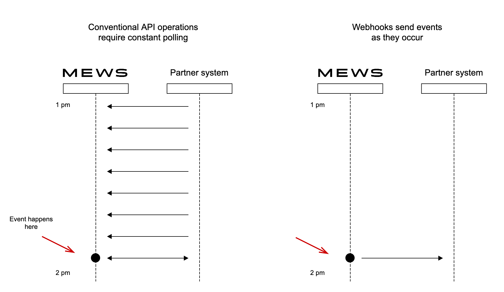
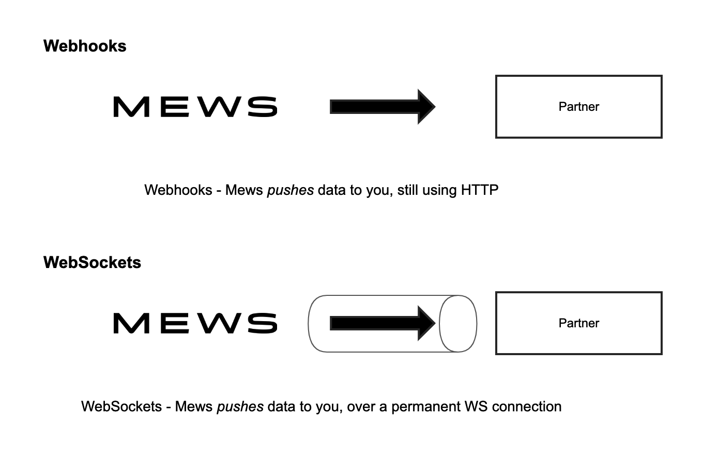

# Ways to communicate

The purpose of this page is to provide an overview of the three different ways to interact with the API and suggest when you might use each particular one.
The main way to integrate with Mews is to use the API [Operations](../operations/README.md) to make requests, e.g. to fetch data or to request some other action.
However, we also support [Webhooks](../webhooks/README.md) and [WebSockets](../websockets/README.md) for special cases where polling is not efficient or not real-time enough.

> ### Three ways to communicate
>
> * [API Operations](#API-operations)
> * [Webhooks](#webhooks)
> * [WebSockets](#websockets)

## API Operations

Most of the functionality in the API is in the form of API Operations.
These operations work on a stateless, request-response basis. That means when you want to interact, you choose the moment and send a request, to which you will receive a response.
If the request is for information, then the response will normally contain the requested information.
If the request is to make an action of some sort, then the response may just be a success message to tell you the action was performed by Mews ok.

* For the details of individual API operations, see [Operations](../operations/README.md).

But what if you want to know when some event happens in the Mews system?
Using the standard request-response model, you would need to keep asking "has this event happened yet?".
This is called polling, and is not very efficient. And that's where Webhooks and WebSockets come in.

## Webhooks

A Webhook is the equivalent of Mews saying "don't keep asking if this event has happened yet, instead we'll let you know when it's happened. Give us your contact details and we'll call you."
The contact details in this case is an accessible URL, provided by you.

In summary, API Operations are hosted on the Mews side of the integration and they follow the on-demand request model, whereas Webhooks are hosted on the partner side of the integration, and they follow the event model.
Of course a Webhook is still a web API using request-response because that is how HTTP works, but in this case Mews is doing the requesting; and rather than making the request to get information, Mews is making the request to provide you with information based on some event that occurred in the Mews system.

* For the details of individual Webhooks, the events that generate them and the structure of the data that's sent, see [Webhooks](../webhooks/README.md).

### When are Webhooks generated?

A Webhook is generated when some event occurs in the system, however they are not real-time.
Instead events are queued when they occur, with the queue being periodically read and the Webhooks generated.
That period is a system parameter, but typically 2 minutes.
That means that the lag between an event occuring and the Webhook being generated is between 0 and (typically) 120 seconds.
For most use cases that is absolutely fine, but there are some use cases that require real-time event information, e.g. generating digital keys.
For this case, we have WebSockets.

## WebSockets

A WebSocket is a technology for creating a semi-permanent connection over the web between a client and server, along which messages can pass simultaneously in both directions (called full-duplex).
The connection is actually a TCP connection or 'socket' but over the web, hence the name.

WebSockets thus don't follow the normal request-response pattern on which HTTP, the protocol of the web, is based.
Indeed WebSockets have their own protocol WS which is distinct from HTTP (although cleverly it is compatible with HTTP, which enables a socket connection to be set up over the web).

The advantage of using WebSockets to communicate is that the connection is already set up and ready to go, so it's quick to send a new message.
If you really need low latency messages, i.e. real time messages, WebSockets may be the way to go.
However, there are also disadvantages with using a form of communication that the web wasn't really designed for.
As a result, Mews provides limited WebSocket support, and it should be considered a special case for rare use cases.

* For details of our WebSockets support, including the list of events and the structure of the data that's sent, see [WebSockets](../websockets/README.md).

