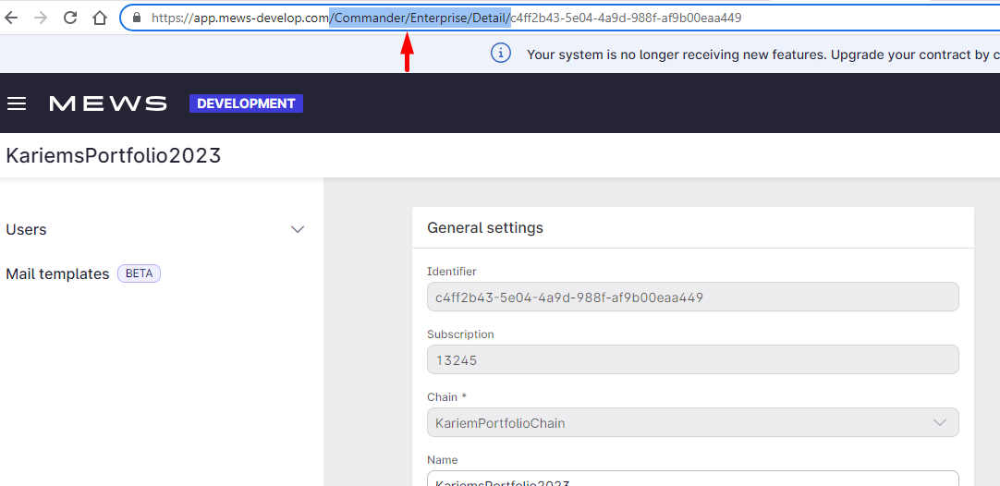
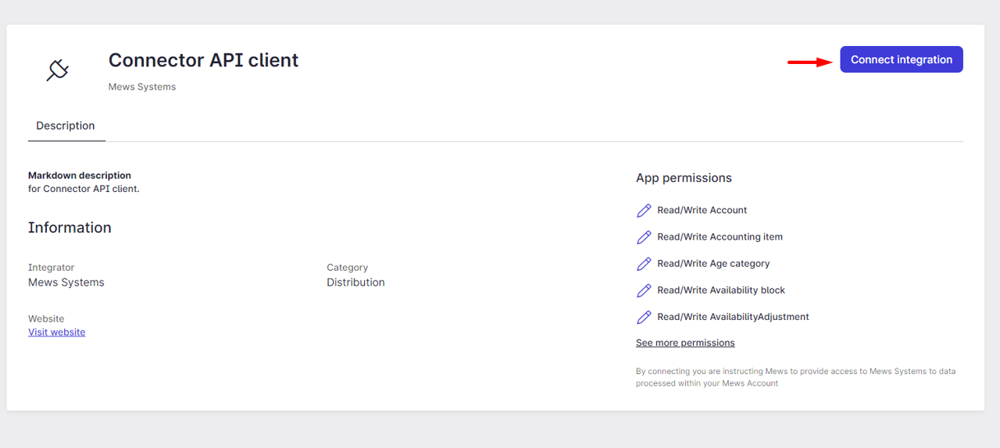
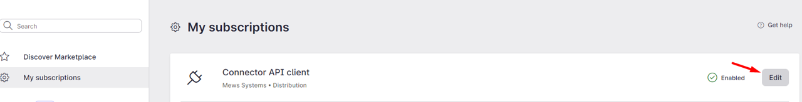
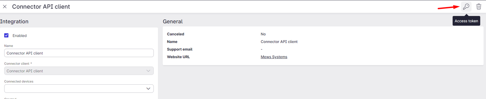

### Connecting to your connector client
In order to obtain an access token you must first connect the connector client for your portfolio by following the steps below.

Navigate to your respective Portfolio and click on the burger bar icon at the top right of the screen and then on 'Portfolio Settings'.

You will reach the page shown in the screenshot below. 

Replace the highlighted part of the URL with the following:
`/Commander/EnterpriseIntegration/Marketplace?OwnerId=`

Now search for the name of your connector client and click on 'Explore' 

Click on 'Connect Integration'

Click on 'Edit'

Click on the key icon to obtain your access token.

