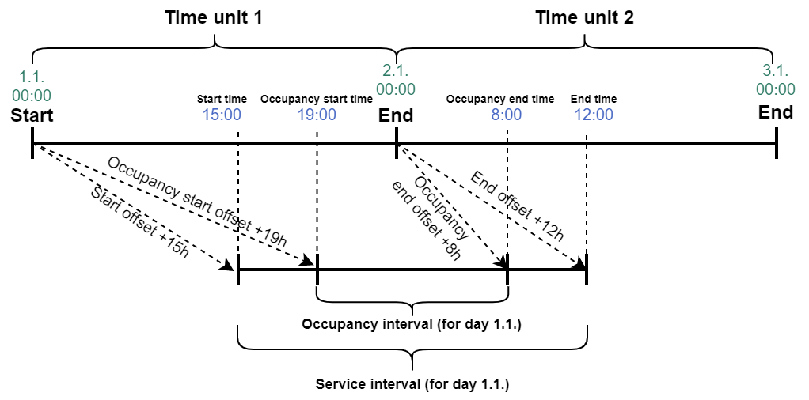
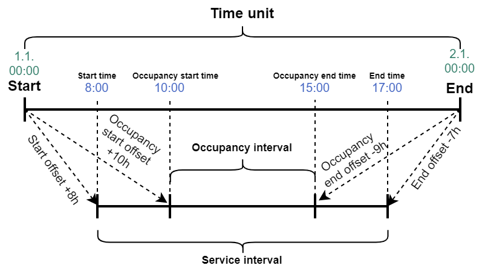

# Services

## Get all services

Returns all services offered by the enterprise.

### Request

`[PlatformAddress]/api/connector/v1/services/getAll`

```javascript
{
    "ClientToken": "E0D439EE522F44368DC78E1BFB03710C-D24FB11DBE31D4621C4817E028D9E1D",
    "AccessToken": "C66EF7B239D24632943D115EDE9CB810-EA00F8FD8294692C940F6B5A8F9453D",
    "Client": "Sample Client 1.0.0"
}
```

| Property | Type | Contract | Description |
| :-- | :-- | :-- | :-- |
| `ClientToken` | string | required | Token identifying the client application. |
| `AccessToken` | string | required | Access token of the client application. |
| `Client` | string | required | Name and version of the client application. |

### Response

```javascript
{
    "Services": [
        {
            "Id": "fc79a518-bc69-45b8-93bd-83326201bd14",
            "IsActive": true,
            "Name": "Restaurant",
            "Options": {
                "BillAsPackage": false
            },
            "Data": {
                "Discriminator": "Additional",
                "Value": {
                    "Promotions": {
                        "BeforeCheckIn": false,
                        "AfterCheckIn": false,
                        "DuringStay": false,
                        "BeforeCheckOut": false,
                        "AfterCheckOut": false,
                        "DuringCheckOut": false
                    }
                }
            },
            "ExternalIdentifier": "SVCE-Restaurant"
        },
        {
            "Id": "bd26d8db-86da-4f96-9efc-e5a4654a4a94",
            "IsActive": true,
            "Name": "Accommodation",
            "Options": {
                "BillAsPackage": true
            },
            "Data": {
                "Discriminator": "Bookable",
                "Value": {
                    "StartOffset": "P0M0DT15H0M0S",
                    "EndOffset": "P0M0DT12H0M0S",
                    "OccupancyStartOffset": "P0M0DT15H0M0S",
                    "OccupancyEndOffset": "P0M0DT12H0M0S",
                    "TimeUnitPeriod": "Day"
                }
            },
            "ExternalIdentifier": "SVCE-Accomm"
        }
    ]
}
```

| Property | Type | Contract | Description |
| :-- | :-- | :-- | :-- |
| `Services` | array of [Service](#service) | required | Services offered by the enterprise. |

#### Service

| Property | Type | Contract | Description |
| :-- | :-- | :-- | :-- |
| `Id` | string | required | Unique identifier of the service. |
| `IsActive` | boolean | required | Whether the service is still active. |
| `Name` | string | required | Name of the service. |
| `Options` | [Service options](#service-options) | required | Options of the service. |
| `Data` | [Service data](#service-data) | required | Additional information about the specific service. |
| `ExternalIdentifier` | string | optional, max 255 characters | Portfolio-level service identifier, chosen by the user for the purposes of portfolio management; called Service Key in Mews Operations. |

#### Service options

| Property | Type | Contract | Description |
| :-- | :-- | :-- | :-- |
| `BillAsPackage` | boolean | required | Products should be displayed as a single package instead of individual items. |

#### Service data

| Property | Type | Contract | Description |
| :-- | :-- | :-- | :-- |
| `Discriminator` | string [Service data discriminator](#service-data-discriminator) | required | Determines type of value. |
| `Value` | object | required | Structure of object depends on [Service data discriminator](#service-data-discriminator). |

#### Service data discriminator

* `Bookable` - Data specific to a bookable service.
* `Additional` - Data specific to an additional service.

#### Bookable service data

| Property | Type | Contract | Description |
| :-- | :-- | :-- | :-- |
| `StartOffset` | string | required | Offset from the start of the [time unit](#time-unit) which defines the default start of the service; expressed in ISO 8601 duration format. |
| `EndOffset` | string | required | Offset from the end of the [time unit](#time-unit) which defines the default end of the service; expressed in ISO 8601 duration format. |
| `OccupancyStartOffset` | string | required | Offset from the start of the [time unit](#time-unit) which defines the occupancy start of the service; expressed in ISO 8601 duration format. 'Occupancy start' is used for availability and reporting purposes, it implies the time at which the booked resource is considered occupied. |
| `OccupancyEndOffset` | string | required | Offset from the end of the [time unit](#time-unit) which defines the occupancy end of the service; expressed in ISO 8601 duration format. 'Occupancy end' is used for availability and reporting purposes, it implies the time at which the booked resource is no longer considered occupied. |
| `TimeUnitPeriod` | [Time unit period](#time-unit-period) | required | The length of time or period represented by a [time unit](#time-unit), for which the service can be booked. |

#### Time unit

Bookable Services are booked in terms of integer multiples of standard `time units`. The length of a time unit depends on the particular service and is given by `time unit period`, which can be obtained through [Get all services](#get-all-services). For example, a service with a time unit period of "Day" can be booked in multiples of days. This is equivalent to booking a hotel room stay for a specified number of days or a specified number of nights.

A monthly time unit, i.e. a time unit with time unit period of "Month", starts at midnight on the first day of the month and ends at midnight on the first day of the following month.

The service is not assumed to start at the beginning of a time unit, e.g. 00:00 midnight for a "Day", nor end at the end of a time unit, e.g. the following midnight. Instead we define `StartOffset` as the offset from the beginning of the time unit at which the service starts, and `EndOffset` as the offset from the end of the time unit at which the service actually ends - see the illustrations below. Similarly, `OccupancyStartOffset` and `OccupancyEndOffset` define the offsets for which the service is considered occupied.

A positive value for `EndOffset` is normal for a nightly stay and implies that the service ends on the following morning. A negative value for `EndOffset` can be used to specify a daytime service that ends before the end of the day.

#### Figure 1: Illustration of a nightly service


#### Figure 2: Illustration of a daytime service


#### Time unit period

* `Day`
* `Month`
* ...

#### Additional service data

| Property | Type | Contract | Description |
| :-- | :-- | :-- | :-- |
| `Promotions` | [Promotions](#promotions) | required | Promotions of the service. |

#### Promotions

| Property | Type | Contract | Description |
| :-- | :-- | :-- | :-- |
| `BeforeCheckIn` | boolean | required | Whether it can be promoted before check-in. |
| `AfterCheckIn` | boolean | required | Whether it can be promoted after check-in. |
| `DuringStay` | boolean | required | Whether it can be promoted during stay. |
| `BeforeCheckOut` | boolean | required | Whether it can be promoted before check-out. |
| `AfterCheckOut` | boolean | required | Whether it can be promoted after check-out. |
| `DuringCheckOut` | boolean | required | Whether it can be promoted during check-out. | 

## Get service availability

Returns availability of a bookable service for a specified time interval including applied availability adjustments. Availability will be returned for all service [time units](services.md#time-unit) that the specified time interval intersects. So, for example, an interval `1st Jan 23:00 UTC - 1st Jan 23:00 UTC` will result in one price for `2nd Jan`, while Interval `1st Jan 23:00 UTC - 2nd Jan 23:00 UTC` will result in two prices for `2nd Jan` and `3rd Jan` (assuming a time unit period of "Day"). UTC timestamps must correspond to the start boundary of a [time unit](services.md#time-unit), e.g. 00:00 converted to UTC for a time unit of "Day". Other timestamps are not permitted. The __maximum size of time interval__ is 100 time units or 2 years, whichever is the shorter amount of time.

### Request

`[PlatformAddress]/api/connector/v1/services/getAvailability`

```javascript
{
    "ClientToken": "E0D439EE522F44368DC78E1BFB03710C-D24FB11DBE31D4621C4817E028D9E1D",
    "AccessToken": "C66EF7B239D24632943D115EDE9CB810-EA00F8FD8294692C940F6B5A8F9453D",
    "Client": "Sample Client 1.0.0",
    "ServiceId": "bd26d8db-86da-4f96-9efc-e5a4654a4a94",
    "FirstTimeUnitStartUtc":"2017-01-01T23:00:00.000Z",
    "LastTimeUnitStartUtc":"2017-01-03T23:00:00.000Z"
}
```

| Property | Type | Contract | Description |
| :-- | :-- | :-- | :-- |
| `ClientToken` | string | required | Token identifying the client application. |
| `AccessToken` | string | required | Access token of the client application. |
| `Client` | string | required | Name and version of the client application. |
| `ServiceId` | string | required | Unique identifier of the [Service](#service) whose availability should be returned. |
| `FirstTimeUnitStartUtc` | string | required | Start of the time interval, expressed as the timestamp for the start of the first [time unit](services.md#time-unit), in UTC timezone ISO 8601 format. The maximum size of time interval is 100 time units or 2 years, whichever is the shorter amount of time. |
| `LastTimeUnitStartUtc` | string | required | End of the time interval, expressed as the timestamp for the start of the last [time unit](services.md#time-unit), in UTC timezone ISO 8601 format. The maximum size of time interval is 100 time units or 2 years, whichever is the shorter amount of time. |


### Response

```javascript
{
    "CategoryAvailabilities": [
        {
            "Availabilities": [ 6, 7, 5 ],
            "Adjustments ": [ 0, 1, -1 ],
            "CategoryId": "773d5e42-de1e-43a0-9ce6-f940faf2303f"
        },
        {
            "Availabilities": [ 7, 7, 7 ],
            "Adjustments ": [ 1, 0, -1 ],
            "CategoryId": "a0a7a5c5-c4ef-494a-8b34-6cca97629076"
        }
    ],
    "TimeUnitStartsUtc": [
        "2017-01-01T23:00:00Z",
        "2017-01-02T23:00:00Z",
        "2017-01-03T23:00:00Z"
    ]
}
```

| Property | Type | Contract | Description |
| :-- | :-- | :-- | :-- |
| `CategoryAvailabilities` | array of [Resource category availability](resources.md#resource-category-availability) | required | Resource category availabilities. |
| `TimeUnitStartsUtc` | array of string | required | Set of all time units covered by the time interval; expressed in UTC timezone ISO 8601 format. |

#### Resource category availability

| Property | Type | Contract | Description |
| :-- | :-- | :-- | :-- |
| `CategoryId` | string | required | Unique identifier of the [Resource category](resources.md#resource-category). |
| `Availabilities` | array of number | required | Absolute availabilities of the resource category in the covered dates. |
| `Adjustments` | array of number | required | Relative availability adjustments set for resource category in the covered dates. |

## Update service availability

Updates the number of available resources in [Resource category](resources.md#resource-category) by a certain amount (relative adjustment). Note that availabilities are defined per time unit, so when the server receives the UTC interval, it first converts it to enterprise timezone and updates the availability on all time units that the interval intersects. It's not allowed to update past availabilities outside of `EditableHistoryInterval`, future updates are allowed for up to 5 years.

### Request

`[PlatformAddress]/api/connector/v1/services/updateAvailability`

```javascript
{
    "ClientToken": "E0D439EE522F44368DC78E1BFB03710C-D24FB11DBE31D4621C4817E028D9E1D",
    "AccessToken": "C66EF7B239D24632943D115EDE9CB810-EA00F8FD8294692C940F6B5A8F9453D",
    "Client": "Sample Client 1.0.0",
    "ServiceId": "bd26d8db-86da-4f96-9efc-e5a4654a4a94",
    "AvailabilityUpdates": [
        {
            "FirstTimeUnitStartUtc": "2020-10-05T23:00:00Z",
            "LastTimeUnitStartUtc": "2020-10-05T23:00:00Z",
            "AvailabilityBlockId": "23e85a44-d95a-4dcf-9f36-acb000b10abe",
            "ResourceCategoryId": "46bc1498-38cf-4d03-b144-aa69012f5d50",
            "UnitCountAdjustment": { "Value": 6 }
        },
        {
            "FirstTimeUnitStartUtc": "2020-10-07T23:00:00Z",
            "LastTimeUnitStartUtc": "2020-10-08T23:00:00Z",
            "ResourceCategoryId": "46bc1498-38cf-4d03-b144-aa69012f5d50",
            "UnitCountAdjustment": { }
        }
    ]
}
```

| Property | Type | Contract | Description |
| :-- | :-- | :-- | :-- |
| `ClientToken` | string | required | Token identifying the client application. |
| `AccessToken` | string | required | Access token of the client application. |
| `Client` | string | required | Name and version of the client application. |
| `ServiceId` | string | required | Unique identifier of the [Service](#service) to update. |
| `AvailabilityUpdates` | array of [Availability update](#availability-update) | required, max 1000 items | Availability updates. |

#### Availability update

| Property | Type | Contract | Description |
| :-- | :-- | :-- | :-- |
| `FirstTimeUnitStartUtc` | string | required | Start of the time interval, expressed as the timestamp for the start of the first [time unit](services.md#time-unit), in UTC timezone ISO 8601 format. The maximum size of time interval is 100 time units or 2 years, whichever is the shorter amount of time. |
| `LastTimeUnitStartUtc` | string | required | End of the time interval, expressed as the timestamp for the start of the last [time unit](services.md#time-unit), in UTC timezone ISO 8601 format. The maximum size of time interval is 100 time units or 2 years, whichever is the shorter amount of time. |
| `AvailabilityBlockId` | string | optional | Unique identifier of the [Availability block](availabilityblocks.md#availability-block) whose availability to update. |
| `ResourceCategoryId` | string | required | Unique identifier of the [Resource category](resources.md#resource-category) whose availability to update. |
| `UnitCountAdjustment` | [Number update value](_objects.md#number-update-value) | required | Adjustment value to be applied on the interval, can be both positive and negative (relative adjustment, not an absolute number). If specified without `Value` parameter, removes all adjustments within the interval. |

### Response

```javascript
{}
```
