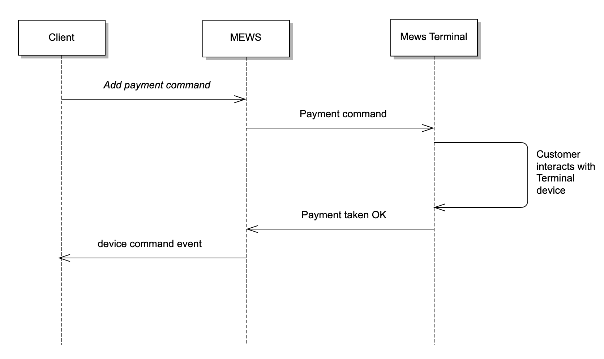
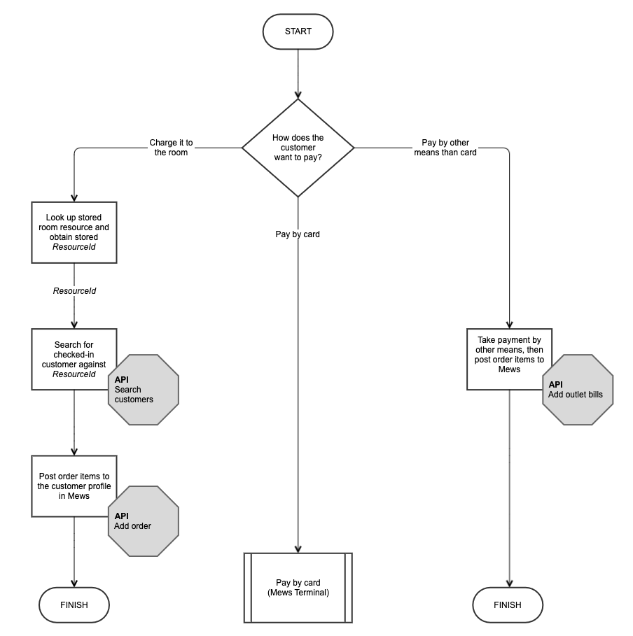
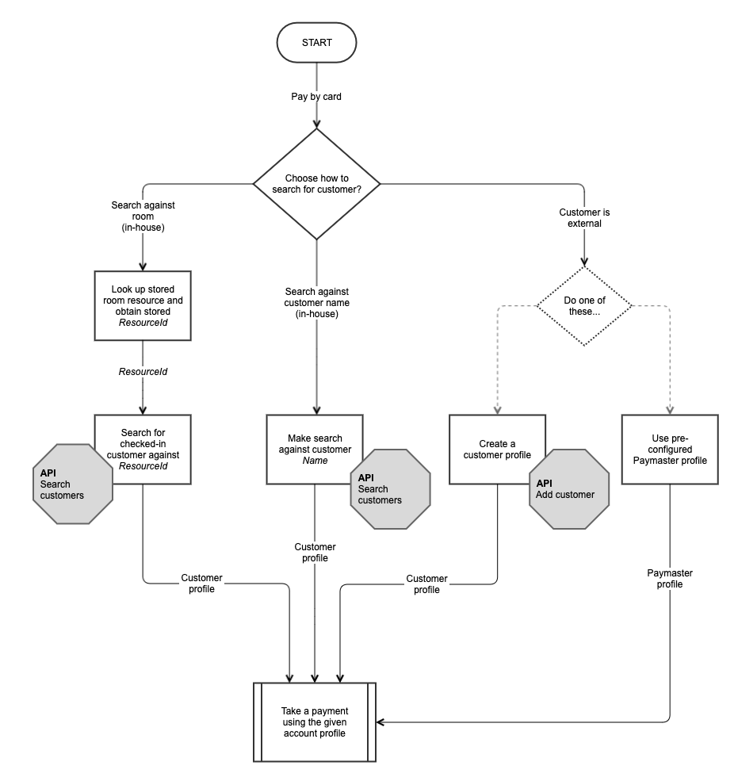
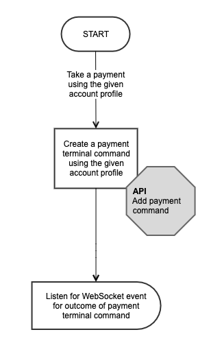
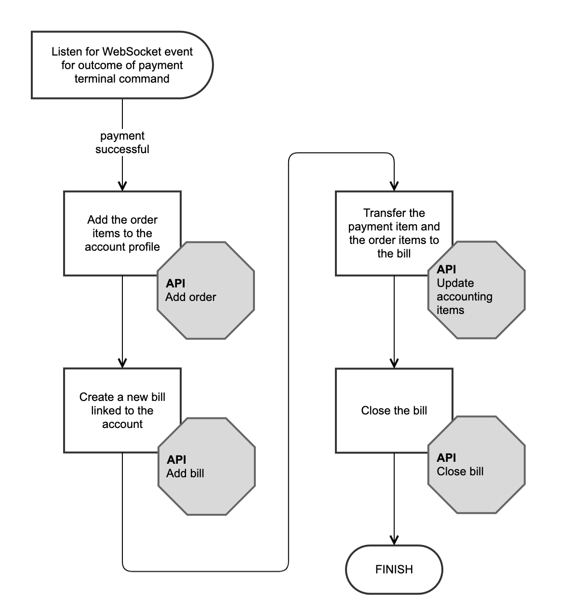
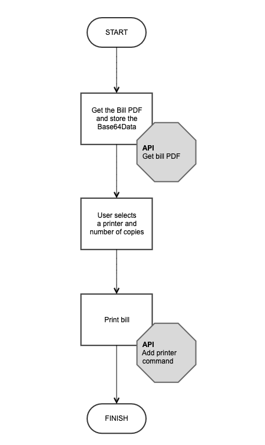

# Mews Payment Terminals

This use case is for Mews customers and partners who want to access [Mews Payment Terminals](https://www.mews.com/en/products/terminals) to take payments from guests.

## Contents

* [Introduction](#introduction)
* [Caution!](#caution)
* [Taking payments](#taking-payments)
* [POS workflow](#pos-workflow)
* [Kiosk workflow](#kiosk-workflow)
* [Fiscal reporting](#fiscal-reporting)
* [Operational procedures](#operational-procedures)
* [Testing](#testing)
* [Help and support](#help-and-support)

## Introduction

This is most likely to be of interest if you have a Point Of Sale solution or a Kiosk solution – but we don't want to limit your imagination if you have a different application in mind!

**POS:** Point Of Sale systems in outlets such as restaurants and shops will normally have their own payment terminals, but they may want to take payments through Mews Terminals for various reasons, perhaps because the terminals are located at reception, or to streamline the property's workflow.

**Kiosk:** Typically, a guest uses a physical kiosk in the lobby for self-service, so they don't need to queue to see a member of staff at reception, if they choose to do so. The primary function of the kiosk is to check in at the property, but they might need to access a payment terminal, e.g. to make an on-site reservation, to pay the balance on an existing reservation, or to pay their bill on check-out.

> **Terminology:** Remember that in the terminology of the Mews Connector API, the party connecting to the API (that's you!) is the _Client_; the hotel, hostel or other such property is the _Enterprise_; and the end-user or guest is the _Customer_.

## Caution!

This use case is still considered a custom, special workflow. We are making the documentation publicly available due to popular demand, but it comes with some caveats. These are important, so please proceed with these caveats in mind. As always, we are open to feedback on the process. The caveats are as follows:

* **Fiscal reporting** - this workflow may have important implications for [fiscal reporting](#fiscal-reporting)

* **Operational procedures** - this workflow may have implications for [operational procedures](#operational-procedures)

* **Development** - the integration may require significant development, because it uses a number of API Operations in conjunction with WebSockets

* **Testing** - testing the workflow will require co-operation with our Partner Support team, because it needs Mews Terminals to be physically connected and configured

Caveats aside, the functionality is available and documented, and certification is available as normal.

## Taking payments

Mews Terminals are considered _devices_, and you communicate with them using [device integration commands](device-integration.md).

The most important API Operation you will need to use is [Add payment command](../operations/commands.md#add-payment-command). This adds a device integration command to the device command queue, with an instruction to take a payment from a specified Mews Terminal device for a specified customer.

Taking a payment is an asynchronous activity, so you will need to wait for a device command _event_ to show that the payment is complete, or in case of error taking the payment. This is done using [WebSockets](../websockets/README.md). Specifically, you will listen for [DeviceCommand](../websockets/README.md#device-command-event) WebSocket events.



### Add payment command

A call to [Add payment command](../operations/commands.md#add-payment-command) looks something like this:

Request URL:

`https://api.mews.com/api/connector/v1/commands/addPaymentTerminal`

Request body:
```javascript
{
    "ClientToken": "E0D439EE522F44368DC78E1BFB03710C-D24FB11DBE31D4621C4817E028D9E1D",
    "AccessToken": "7059D2C25BF64EA681ACAB3A00B859CC-D91BFF2B1E3047A3E0DEC1D57BE1382",
    "Client": "MyPOS 1.0",
    "Type": "Payment",
    "TerminalId": "be35b39e-ad7e-460a-8de9-4c7581e016a2",
    "CustomerId": "35d4b117-4e60-44a3-9580-c582117eff98",
    "BillId": null,
    "Amount": {
        "Currency": "EUR",
        "Value": 230.00
   }
}
```

Response body:
```javascript
{
  "CommandId": "2391a3df-1c61-4131-b6f8-c85b4234adcb"
}
```

As well as the usual authentication parameters, required parameters are:

* Type (either "Payment" or "Preauthorization")
* TerminalId
* CustomerId
* Amount (Currency and Value)

You must address the specific Mews Terminal with `TerminalId` \(see [Obtaining the Terminal ID](#obtaining-the-terminal-id)\), and identify the specific customer with `CustomerId` \(see [Identifying the customer](#identifying-the-customer)\).

### WebSocket event

The WebSocket event you are listening for is a [DeviceCommand](../websockets/README.md#device-command-event) event which matches the CommandId returned from [Add payment command](../operations/commands.md#add-payment-command). For example:

```javascript
{
  "Type": "DeviceCommand",
  "Id": "2391a3df-1c61-4131-b6f8-c85b4234adcb",
  "State": "Processed"
}
```

The `State` field will tell you whether the payment was successful or not.

### Obtaining the Terminal ID

A Mews Terminal is a type of _device_. The Terminal IDs for all connected Mews Terminals can be obtained by calling the [Get all devices](../operations/devices.md#get-all-devices) API operation. You can call this operation on initialization and store the Terminal IDs.

### Identifying the customer

As stated, you must identify the specific customer with `CustomerId` when communicating with a Mews Terminal through the API. `CustomerId` is the unique identifier of the customer profile or account profile, and can be obtained through the [Search customers](../operations/customers.md#search-customers) API operation. For more information, see [POS Workflow](#pos-workflow) below.

## POS workflow

As a POS system, you would normally use [Add outlet bills](../operations/outletbills.md#add-outlet-bills) to send revenue and payments to Mews. However, if you need to use a Mews Terminal to take a payment, you instead use [Add payment command](../operations/commands.md#add-payment-command) to add a card payment to a customer profile, and [Add order](../operations/orders.md#add-order) to add order items, instead of using outlet items.
The following workflow describes the steps of the process:

* [Pre-conditions](#pre-conditions)
* [Step 1: How does the customer want to pay?](#step-1-how-does-the-customer-want-to-pay)
* [Step 2: Choose how to search for the customer](#step-2-choose-how-to-search-for-the-customer)
* [Step 3: Instruct the terminal to take the payment](#step-3-instruct-the-terminal-to-take-the-payment)
* [Step 4: Add the order items and prepare the bill](#step-4-add-the-order-items-and-prepare-the-bill)
* [Step 5: Print the bill for the customer](#step-5-print-the-bill-for-the-customer)

### Pre-conditions

You must fetch the following information before starting the main workflow:

* **Room resources** - if you want to do room lookup, you must fetch the room or space resources for the enterprise and store the corresponding resource identifiers \(see [Choose how to search for the customer](#step-2-choose-how-to-search-for-the-customer)\)

* **Paymaster profile** - if using a Paymaster account, you must set this up and store the account identifier \(see [Customer profile vs Paymaster profile](#customer-profile-vs-paymaster-profile)\)

* **Terminal IDs** - you must fetch the identifiers of the Mews Terminal devices you want to connect to \(see [Obtaining the Terminal ID](#obtaining-the-terminal-id)\)

### Step 1: How does the customer want to pay?

If the customer wants to charge the payment to the room, then follow the standard "post to room" workflow - perform room lookup with [Search customers](../operations/customers.md#search-customers) to find the customer profile, then post the order items to the customer profile using [Add order](../operations/orders.md#add-order).

If the customer wants to pay by means other than a card at the terminal, then take the payment by other means (outside Mews), then follow the standard "revenue push" workflow - post the order items to Mews using [Add outlet bills](../operations/outletbills.md#add-outlet-bills).



What follows applies to the main workflow where the customer wants to **pay by card** using the terminal.

### Step 2: Choose how to search for the customer

When using a Mews Terminal to take a payment, you will need the account profile of the customer, identified with a unique identifier. This is what is referred to as a Customer ID or CustomerId.
How you obtain the customer identifier depends on the search scenario - room lookup, name lookup, or "customer is external".

#### Room lookup
If doing a room lookup, search against your stored list of room resources or spaces and obtain the Resource identifier for that space, then use the Resource identifier in a lookup for the checked-in customer using [Search customers](../operations/customers.md#search-customers). This will return the Customer identifier or CustomerId.

#### Name lookup
If doing a name lookup, make a search against the customer's name directly, using [Search customers](../operations/customers.md#search-customers). This will return the Customer identifier or CustomerId.

#### Customer is external
If the customer is external, i.e. not staying in the property, then you have two choices. You could either create a customer profile for that customer and take the payment against that, or you could use a pre-configured Paymaster profile and take the payment against that. See [Customer profile vs Paymaster profile](#customer-profile-vs-paymaster-profile) for a discussion of the alternatives. To create a customer profile, use [Add customer](../operations/customers.md#add-customer).



### Step 3: Instruct the terminal to take the payment
Now that you have the account identifier for the account profile, either customer account or Paymaster account, you can take the payment. Choose from available terminals and use the Terminal ID for that terminal. Call the [Add payment command](../operations/commands.md#add-payment-command) operation and store the Command ID returned.

<p align="center">
  
</p>

### Step 4: Add the order items and prepare the bill

Wait for an incoming WebSocket DeviceCommand message that matches the stored Command ID. Look at the `State` field to determine the success or otherwise of the operation. You may also want to implement a timeout process in case you don't receive an event in a timely manner.

Assuming the State is "Processed", your next steps will be as follows:

1. Add the order items to the account profile, using [Add order](../operations/orders.md#add-order) *1
2. Create a new, empty bill linked to the account, using [Add bill](../operations/bills.md#add-bill)
3. Transfer both the payment item and the order items to the bill, so it balances to zero, using [Update accounting items](../operations/accountingitems.md#update-accounting-items)
4. Close the bill to further changes, using [Close bill](../operations/bills.md#close-bill); Mews will handle fiscalization of the bill, if applicable

> *1 Note that orders can't be cancelled through the API once added, so it's important to do this once the payment is confirmed. Otherwise, if there was a problem with the payment and the customer switched to cash to pay, then the order item would be posted twice, once against the profile and once posted as an outlet bill.



#### Payment unsuccessful
If the payment is _not_ successful, the value of `State` will give an indication of the cause. In any case, you must return to the start of the process and consider an alternative means of payment.

### Step 5: Print the bill for the customer

You will want to present a copy of the bill to the customer. One way to do this is to fetch a bill from Mews as a PDF document and print it out through a Mews connected printer.

1. Optional: Get the bill PDF and store the Base64Data, using [Get bill PDF](../operations/bills.md#get-bill-pdf)
2. Optional: The user selects the printer and the number of copies required
3. Optional: Print the bill, using [Add printer command](../operations/commands.md#add-printer-command) (like terminals, a printer is another type of connected device)

<p align="center">
  
</p>

Now you are finished!

### Customer profile vs Paymaster profile

Where the customer is not known to the system, such as a non-resident guest, you have two options for how to proceed.

#### Customer profile
Ideally, you would create a real customer profile each time, with real details such as name and email address. When this customer returns, you can then look up their profile in the POS, just like for a resident guest. However, some care is needed with such an implementation. For example, if there is more than one customer in the system with the same name, you will have to store some other identifying information and then ask the customer for verification. This workflow would also require the POS to be able to create and manage customer profiles.

#### Paymaster profile
Alternatively, all payments could be made against a single, pre-defined Paymaster profile. This keeps things centralized, but it requires some workarounds as the Mews system is not designed to work in this way, specifically you need to make sure all the bills are closed to keep things clean and manageable. Potentially you would have a single account profile with lots of payment cards under the Payments tab.

To clear down the payments in the account, you could do this manually at the end of each period, e.g. end-of-shift or end-of-day, or you could do it programmatically via the API. The API supports [Update accounting items](../operations/accountingitems.md#update-accounting-items) for moving specific order items to a bill, and [Close bill](../operations/bills.md#close-bill) for closing bills. This would of course require further development on the part of the POS partner.

## Kiosk workflow

Most of the workflow is common to the POS workflow, for which see above.

#### Displaying the list of open items
To retrieve and display open items against a customer account, use [Get customers open items](../operations/customers.md#get-customers-open-items) and filter the request by date-time to pick out items relevant to the customer's stay. This helps to avoid any confusion in case the customer has a future reservation.

## Fiscal reporting

Be aware that, depending on the country in which you operate, you may need workarounds for fiscal reporting. This is due to the fact that you will be posting payments as actual payments in Mews, rather than just as Outlet items. Payments in Mews will use Mews's fiscal reporting, so if you also use fiscal reporting in the POS system there is a danger of duplicated reporting.

This will depend on the fiscal and accounting requirements in the legal environment in which you operate, e.g. in Belgium all POS tickets need to go to the Blackbox Fiscal Data Module, regardless of whether a payment is a room charge or a cash or credit card transaction.


## Operational procedures

The impact on operational procedures centers around the fact that Mews Terminal payments have to be posted to a customer profile in Mews.

You will have to either create and manage customer profiles, or work with a shared Paymaster account, but in the latter case you will then have to create a process to close all bills at the end of each operating period. Each approach has pros and cons. This is discussed in [Customer profile vs Paymaster profile](#customer-profile-vs-paymaster-profile) above. Please review all the requirements before deciding on your workflow implementation.

## Testing

To test your workflow implementation with an actual Mews Terminal device, please contact our Partner Support team - they can be contacted at [partnersuccess@mews.com](mailto:partnersuccess@mews.com). They will supply you with the necessary details to connect to a test configuration:

- **Mews Operations**
  - Mews Operations platform address, for the appropriate test server
  - Test account username and password
  - Test property or enterprise name

- **Mews Connector API**
  - Mews API platform address, for the appropriate environment
  - WebSocket address

- **Test integration**
  - Integration name
  - Client Token
  - Access Token

- **Terminal device**
  - Device name
  - Device ID / Terminal ID

When testing [Add payment command](../operations/commands.md#add-payment-command) to communicate with a Mews Terminal, note that just like other device commands, the command will be added to the _Device Commands Queue_ and can be viewed by logging in to **Mews Operations**. The queue also shows the state of the transaction, so you can see if the payment was processed successfully or not, or if it is still pending.

Finally, when a payment is taken through a Mews Terminal, it will appear against that customer's profile in **Mews Operations** under the _Payments_ tab, just the same as any other payment item.


## Help and support

Within the Connector API documentation, the following sections may be helpful:

- [Add payment command](../operations/commands.md#add-payment-command)
- [WebSockets](../websockets/README.md)
- [Use cases - Device integration](device-integration.md)
- [Use cases - Kiosk](kiosk.md)
- [Use cases - Point of sale](point-of-sale.md)

There are a number of articles on Mews Help that may also provide additional assistance:

- [Mews Terminals \(various\)](https://help.mews.com/s/global-search/mews%20terminal?language=en_US)
- [The Device Commands Queue](https://help.mews.com/s/article/device-commands-queue)
- [Create a customer profile](https://help.mews.com/s/article/create-a-customer-profile?language=en_US)

If you still require assistance, please get in touch at [partnersuccess@mews.com](mailto:partnersuccess@mews.com).
